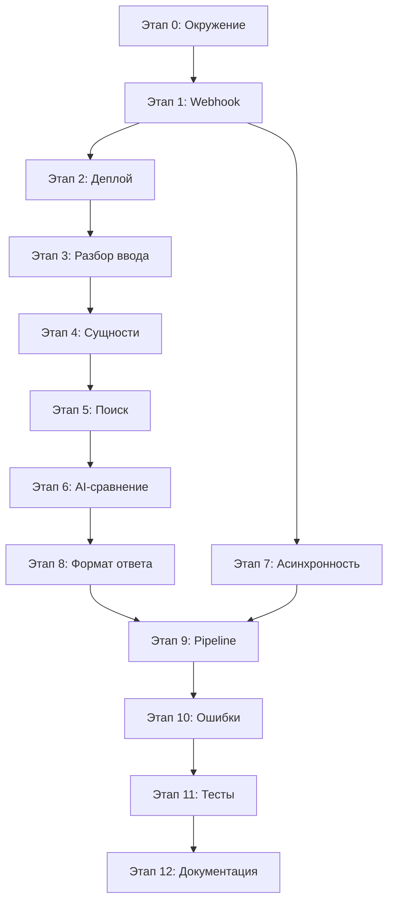

# План реализации FindOrigin

Поэтапный порядок работ по реализации Telegram-бота согласно [PROJECT.md](./PROJECT.md).

---

## Этап 0. Подготовка окружения

**Цель:** создать каркас проекта и настроить секреты.

1. Инициализировать Next.js-проект (App Router, TypeScript).
2. Добавить `.env.example` с переменными:
   - `TELEGRAM_BOT_TOKEN` — токен бота от [@BotFather](https://t.me/BotFather)
   - `TELEGRAM_WEBHOOK_SECRET` — секрет для проверки запросов от Telegram
   - `OPENAI_API_KEY` (или аналог) — для AI-сравнения смысла
   - `SEARCH_API_KEY` — ключ поискового API (Google Custom Search, SerpAPI, Tavily и т.п.)
3. Проверить `.gitignore` (уже настроен).
4. Создать базовую структуру каталогов:

```
app/
  api/
    webhook/
      route.ts          # POST-обработчик Telegram
lib/
  telegram/               # клиент Telegram API
  parser/                 # извлечение текста и сущностей
  search/                 # поиск источников
  ai/                     # семантическое сравнение
  types/                  # общие типы
```

**Результат:** проект запускается локально (`npm run dev`), переменные окружения задокументированы.

---

## Этап 1. Минимальный Telegram webhook

**Цель:** бот отвечает на сообщения, webhook возвращает 200 OK быстро.

1. Реализовать `lib/telegram/client.ts`:
   - `sendMessage(chatId, text)` — вызов `https://api.telegram.org/bot<TOKEN>/sendMessage`
   - обработка ошибок API
2. Реализовать `app/api/webhook/route.ts`:
   - принимать POST с JSON (Telegram Update)
   - извлечь `update.message.chat.id` и `update.message.text`
   - игнорировать update без `message.text` (фото, стикеры и т.д.) — ответить заглушкой или пропустить
   - отправить эхо-ответ через `sendMessage`
   - вернуть `Response.json({ ok: true }, { status: 200 })`
3. **Важно:** не выполнять долгие операции внутри webhook — на этом этапе это просто эхо.
4. Локально протестировать через ngrok / Cloudflare Tunnel или сразу деплой на Vercel.

**Результат:** пользователь пишет боту — получает ответ; webhook отвечает за < 1 с.

---

## Этап 2. Регистрация webhook и деплой на Vercel

**Цель:** бот работает в production.

1. Задеплоить проект на Vercel, добавить env-переменные в настройках проекта.
2. Зарегистрировать webhook у Telegram:
   ```powershell
   Invoke-RestMethod -Uri "https://api.telegram.org/bot<TOKEN>/setWebhook" -Method Post -Body @{ url = "https://<domain>/api/webhook"; secret_token = "<SECRET>" }
   ```
3. Проверить webhook: `getWebhookInfo`.
4. Добавить проверку заголовка `X-Telegram-Bot-Api-Secret-Token` в route handler.

**Результат:** бот доступен 24/7 на Vercel.

---

## Этап 3. Разбор входных данных

**Цель:** получить единый текст из сообщения пользователя.

1. Определить тип ввода в `lib/parser/input.ts`:
   - **обычный текст** — использовать как есть
   - **ссылка на Telegram-пост** — распознать форматы:
     - `https://t.me/<channel>/<message_id>`
     - `https://t.me/c/<chat_id>/<message_id>` (приватные каналы)
2. Для ссылок на публичные посты:
   - попробовать получить текст через публичный preview (`t.me` / oEmbed / парсинг HTML)
   - если недоступно — сообщить пользователю, что нужен пересланный текст или публичный канал
3. Нормализовать текст: обрезка пробелов, удаление лишних переносов.

**Результат:** функция `extractInputText(rawMessage: string): Promise<string>` возвращает чистый текст для анализа.

---

## Этап 4. Извлечение ключевых сущностей

**Цель:** подготовить структурированные данные для поиска.

1. Создать тип `ParsedInput`:

```typescript
type ParsedInput = {
  rawText: string;
  claims: string[];      // ключевые утверждения
  dates: string[];
  numbers: string[];
  names: string[];
  links: string[];
};
```

2. Реализовать `lib/parser/extract.ts`:
   - **ссылки** — regex + URL parsing
   - **даты** — regex + распознавание форматов (DD.MM.YYYY, «5 июля 2026» и т.п.)
   - **числа** — суммы, проценты, статистика
   - **имена** — через AI (prompt: «выдели имена людей, организаций, брендов») или NER-библиотеку
   - **утверждения** — через AI: разбить текст на 1–5 ключевых фактов/утверждений
3. Сформировать поисковые запросы из сущностей (`lib/search/queryBuilder.ts`):
   - комбинации: утверждение + дата, утверждение + имя, ключевые слова

**Результат:** из любого текста получаем структуру для целенаправленного поиска.

---

## Этап 5. Поиск возможных источников

**Цель:** найти кандидатов среди официальных сайтов, новостей, блогов, исследований.

1. Выбрать и подключить Search API (рекомендация: Tavily или Google Custom Search).
2. Реализовать `lib/search/searchSources.ts`:
   - выполнить 2–4 поисковых запроса по `ParsedInput`
   - фильтровать результаты:
     - исключить соцсети, агрегаторы без контента
     - приоритет: `.gov`, `.edu`, крупные СМИ, официальные домены организаций
   - вернуть 10–15 URL с заголовком и snippet
3. Для каждого URL (опционально на первом этапе — только snippet):
   - получить расширенный текст страницы (fetch + cheerio / readability)
   - ограничить объём (первые N символов) для передачи в AI

**Результат:** список кандидатов `{ url, title, excerpt }[]`.

---

## Этап 6. AI-сравнение по смыслу

**Цель:** выбрать 1–3 наиболее вероятных источника с оценкой уверенности.

1. Реализовать `lib/ai/compareSources.ts`:
   - вход: исходный текст/утверждения + массив кандидатов
   - prompt: «Сравни смысл, а не буквальное совпадение. Оцени, насколько каждый источник может быть первоисточником или ранним публикатором информации.»
   - выход:

```typescript
type SourceMatch = {
  url: string;
  title: string;
  confidence: number;   // 0–100
  reasoning: string;    // краткое обоснование
};
```

2. Отсортировать по `confidence`, взять топ 1–3 (с порогом, например ≥ 40%).
3. Если ни один источник не подходит — честно сообщить пользователю.

**Результат:** ранжированный список источников с оценкой.

---

## Этап 7. Асинхронная обработка (важно для webhook)

**Цель:** webhook остаётся быстрым, тяжёлая работа выполняется отдельно.

Telegram ждёт ответ webhook ~60 с, но лучше отвечать сразу. Варианты для Vercel:

1. **Простой (MVP):** webhook сразу отвечает 200, затем в том же invocation выполняет pipeline (риск timeout на Vercel — 10–60 с).
2. **Рекомендуемый:** webhook:
   - отправляет «Ищу источники…»
   - вызывает внутренний endpoint `/api/process` через `fetch` без await (fire-and-forget) **или** использует Vercel Background Functions / очередь
   - `/api/process` выполняет этапы 3–6 и шлёт финальный ответ через `sendMessage`

**Результат:** пользователь получает быстрый ack, затем — результат поиска.

---

## Этап 8. Форматирование ответа пользователю

**Цель:** понятный и компактный вывод в Telegram.

1. Реализовать `lib/telegram/formatResponse.ts`:
   - заголовок: «Найденные источники»
   - для каждого источника:
     - ссылка (markdown/HTML parse mode)
     - уверенность: «85%»
     - одно предложение обоснования
   - если источники не найдены — подсказка (уточнить текст, добавить дату/имя)
2. Учесть лимит Telegram (4096 символов) — обрезать при необходимости.

**Результат:** пользователь видит 1–3 ссылки с оценкой уверенности.

---

## Этап 9. Сборка pipeline и интеграция

**Цель:** связать все модули в единый поток.

1. Создать `lib/pipeline/findOrigin.ts`:

```
входной текст
  → extractInputText
  → extractEntities (ParsedInput)
  → buildSearchQueries
  → searchSources
  → compareSources (AI)
  → formatResponse
  → sendMessage
```

2. Подключить pipeline к `/api/process`.
3. Webhook вызывает process при получении текста/ссылки.

**Результат:** end-to-end сценарий работает.

---

## Этап 10. Обработка ошибок и edge cases

1. Пустое сообщение / только эмодзи — вежливый ответ.
2. Ссылка недоступна — объяснение и просьба прислать текст.
3. Search API / AI недоступны — сообщение об ошибке, логирование.
4. Rate limiting — не спамить Search API; кэшировать результаты по hash текста (опционально).
5. Логирование (console / Vercel Logs) для отладки без утечки секретов.

**Результат:** бот стабильно ведёт себя в нештатных ситуациях.

---

## Этап 11. Тестирование

1. **Unit-тесты:** парсер дат/ссылок, query builder, форматирование ответа.
2. **Интеграционные:** mock Telegram update → webhook → mock search/AI.
3. **Ручные сценарии:**
   - короткий факт с датой
   - длинный текст с несколькими утверждениями
   - ссылка на публичный Telegram-пост
   - текст без явного источника (ожидаем «не найдено»)

**Результат:** ключевые модули покрыты тестами, сценарии проверены вручную.

---

## Этап 12. Документация и финализация

1. Обновить `README.md`:
   - описание бота
   - локальный запуск
   - настройка переменных окружения
   - деплой на Vercel
   - регистрация webhook
2. Проверить `.env.example`.
3. Финальный деплой, smoke-test в production.

**Результат:** проект готов к использованию и сопровождению.

---

## Порядок приоритетов (MVP → полная версия)

| Приоритет | Этапы | Что получаем |
|-----------|-------|--------------|
| P0 — MVP | 0, 1, 2, 3, 5, 6, 8, 9 | Бот принимает текст, ищет источники, отвечает с AI-оценкой |
| P1 | 4, 7 | Структурированное извлечение сущностей, быстрый webhook |
| P2 | 10, 11, 12 | Надёжность, тесты, документация |

---

## Зависимости между этапами



---

## Оценка трудозатрат (ориентир)

| Этап | Оценка |
|------|--------|
| 0–2 | 0.5–1 день |
| 3–4 | 1 день |
| 5–6 | 1–2 дня |
| 7–9 | 1 день |
| 10–12 | 1 день |
| **Итого** | **~5–6 дней** |
